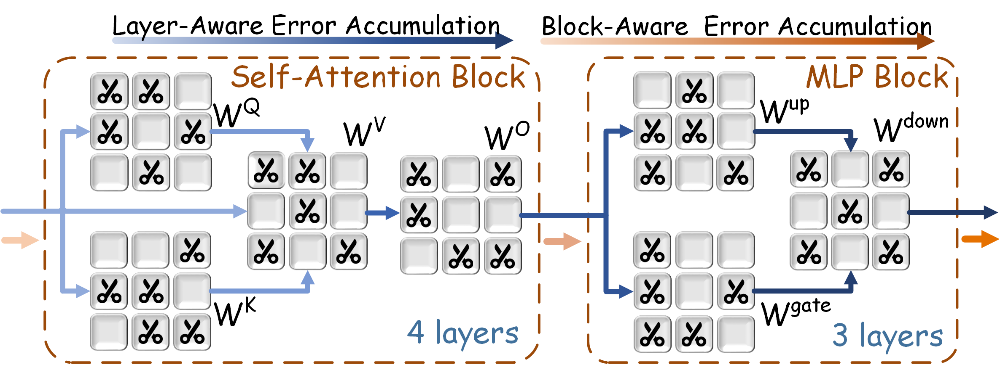
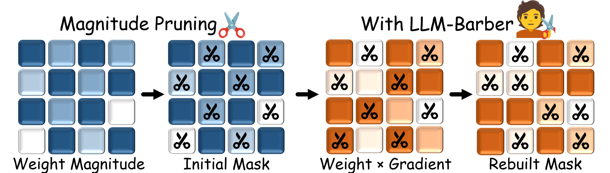

<<<<<<< HEAD
# AutoPrune: A Unified Framework for LLM Pruning

AutoPrune is a versatile pruning framework designed to support and implement various state-of-the-art pruning techniques for Large Language Models (LLMs). This framework allows for easy application and benchmarking of methods including:

* Magnitude Pruning
* SparseGPT
* Wanda
* LLM-Barber

The LLM-Barber method, a key component of this framework, is detailed in:
> [LLM-Barber: Block-Aware Rebuilder for Sparsity Mask in One-Shot for Large Language Models [arxiv]](https://arxiv.org/abs/2408.10631)

This framework is part of the work presented in the **DAC 2025 Poster: LLM-Barber: Block-Aware Rebuilder for Sparsity Mask in One-Shot for Large Language Models**.


Transition from the layer-aware to block-aware error accumulation to achieve an optimized global solution (as presented in LLM-Barber).

Rebuilding sparsity mask using a novel pruning metric based on weights multiplied by gradients (as presented in LLM-Barber).

## Setup
To install, follow the instructions in the [INSTALL.md](INSTALL.md) file.

## Usage
The `main.py` script is the central point for applying all supported pruning methods. The [scripts](./scripts/) directory houses all Bash commands necessary to reproduce the primary findings presented for the LLM-Barber paper and can be adapted for other methods.

The overall code execution remains largely the same; you can select and configure the desired pruning technique by modifying the script arguments.

The following command demonstrates pruning LLaMA-7B with the LLM-Barber method to achieve 50% unstructured sparsity, based on the Wanda initialization method. You can change `--prune_method` and related flags to use other techniques like Magnitude or SparseGPT.

```python
python main.py \
    --model huggyllama/llama-7b \
    --prune_method wanda \
    --sparsity_ratio 0.5 --sparsity_type unstructured  \
    --prune_barber --prune_granularity output1 --threshold 0.01 \
    --save_model /path/to/save/model --save_ppl /path/to/save/ppl --save_zeroshot /path/to/save/zeroshot \
    --delete
```

Here's an overview of the arguments used in the command:

- `--model`: Specifies the LLaMA model to use from the Hugging Face model hub.
- `--prune_method`: Selects the pruning method, option [`magnitude`, `sparsegpt`, `wanda`]. When using LLM-Barber, this flag specifies the initialization method.
- `--sparsity_ratio`: Sets the sparsity ratio, meaning the percentage of the weights will be pruned.
- `--sparsity_type`: Specifies the type of sparsity [`unstructured`,`2:4`,`4:8`].
- `--prune_barber`: This flag indicates that the model will be pruned with LLM-Barber. If not set, the base method selected by `--prune_method` will be used.
- `--prune_granularity`: Specifies the granularity of the pruning for LLM-Barber, option [`block`, `layer`, `output1`, `input1`].
- `--threshold`: Sets the mask rebuilding ratio of LLM-Barber, default is 0.01.
- `--save_model`: Defines the directory where the pruned model will be saved.
- `--save_ppl`: Defines the directory where the perplexity results will be saved.
- `--save_zeroshot`: Defines the directory where the zero-shot results will be saved.
- `--delete`: This flag indicates that the pruned model should be deleted after the experiment

This command will run the `main.py` script with the specified arguments. For the example above, it prunes the "huggyllama/llama-7b" model using the LLM-Barber technique (initialized with Wanda) with a sparsity ratio of 0.5 and unstructured sparsity. The results will be saved to the specified directories, and the pruned model will be deleted after the experiment.

To implement structured N:M sparsity (e.g., with LLM-Barber initialized by Wanda), set the `--sparsity_type` argument to either "2:4" or "4:8". An example command is provided below:

```python
python main.py \
    --model huggyllama/llama-7b \
    --prune_method wanda \
    --sparsity_ratio 0.5 --sparsity_type 2:4  \
    --prune_barber --prune_granularity output1 --threshold 0.01 \
    --save_model /path/to/save/model --save_ppl /path/to/save/ppl  \
    --delete
```

## Acknowledgement

This framework integrates and extends concepts from repositories for [Wanda](https://github.com/locuslab/wanda) and [SparseGPT](https://github.com/IST-DASLab/sparsegpt).

